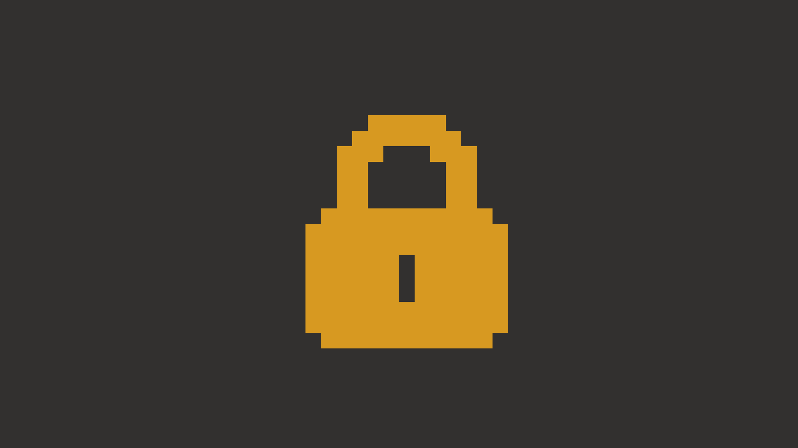
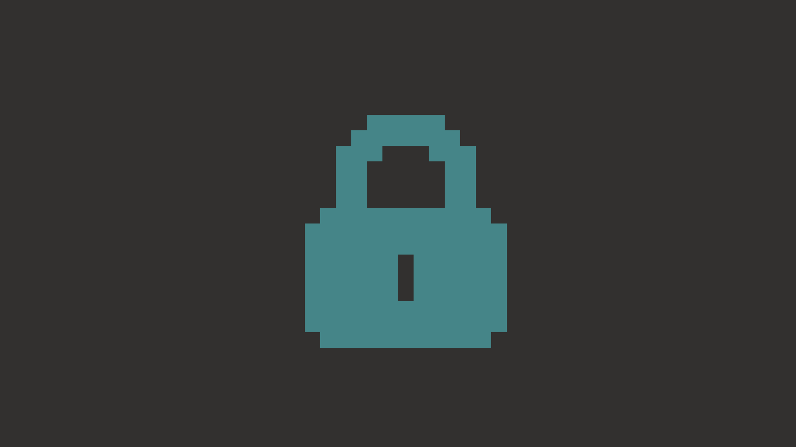
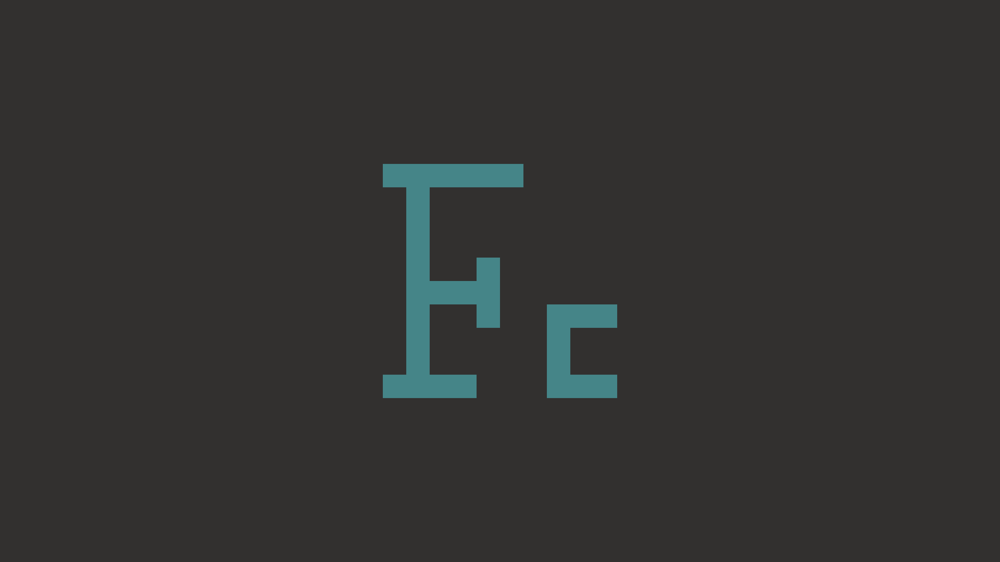

<div align="center">
    
    <h1>slock</h1>
    <p>Simple screen locker utility for X.</p>
</div>

Similar to [dwm-flexipatch](https://github.com/Zen-Path/dwm-flexipatch) this
[slock](https://tools.suckless.org/slock/) 1.6 (3791a99, 2025-08-16) fork uses
preprocessor directives to decide whether or not to include a patch into the final
binary.

Both patched and unpatched code are included in the source. Patches are enabled or
disabled at build time via flags defined in [patches.h](./patches.h).

For example, to enable the `capscolor` patch, flip the setting from `0` to `1`:

```c
#define CAPSCOLOR_PATCH 1
```

This fork automatically runs [flexipatch-finalizer](https://github.com/Zen-Path/flexipatch-finalizer)
during installation.

Unlike its typical use (removing unused code from the source), here it is only applied
to the generated `config.h`. This produces a simplified version of the configuration
file, making it easier to inspect the active build configuration.

This step does **not** modify the rest of the source code.

- [Setup](#setup)
  - [Requirements](#requirements)
  - [Installation](#installation)
  - [Usage](#usage)
- [Preview](#preview)
- [Changelog](#changelog)
- [Patches included](#patches-included)

## Setup

### Requirements

You need the Xlib header files installed (`libX11` on Arch).

### Installation

1. Edit [config.mk](./config.mk) to match your setup (default prefix is `/usr/local`).
2. Build and install:

```sh
sudo make clean install
```

### Usage

Run:

```sh
slock
```

To unlock the screen, enter your user password and press Enter.

## Preview

Check out these lock screen designs:

<p align="center">
  
  
</p>

<p align="center">
  
  
  
</p>

<p align="center">
  
  
</p>

## Changelog

2025-11-15 - Added the visual unlock patch

2022-03-28 - Added the background image patch

2021-09-13 - Added the dwm logo patch

2021-09-09 - Added the auto-timeout, failure-command and secret-password patches

2021-06-08 - Added the color message patch

2020-08-03 - Added alpha, keypress_feedback and blur_pixelated_screen patches

2019-11-27 - Added xresources patch

2019-10-17 - Added capscolor, control clear, dpms, mediakeys, message, pam auth, quickcancel patches

2019-10-16 - Introduced [flexipatch-finalizer](https://github.com/bakkeby/flexipatch-finalizer)

## Patches included

   - [alpha](https://github.com/khuedoan/slock)
      - enables transparency for slock
      - intended to be combined with a compositor that can blur the transparent background

   - [auto-timeout](https://tools.suckless.org/slock/patches/auto-timeout/)
      - allows for a command to be executed after a specified time of inactivity

   - [background_image](https://tools.suckless.org/slock/patches/background-image/)
      - sets the lockscreen picture to a background image

   - [blur_pixelated_screen](https://tools.suckless.org/slock/patches/blur-pixelated-screen/)
      - sets the lockscreen picture to a blurred or pixelated screenshot

   - [capscolor](https://tools.suckless.org/slock/patches/capscolor/)
      - adds an additional color to indicate the state of Caps Lock

   - [color-message](https://tools.suckless.org/slock/patches/colormessage/)
      - based on the message patch this patch lets you add a message to your lock screen using
        24-bit color ANSI escape codes

   - [control-clear](https://tools.suckless.org/slock/patches/control-clear/)
      - with this patch slock will no longer change to the failure color if a control key is pressed
        while the buffer is empty
      - this may be useful if, for example, you wake your monitor up by pressing a control key and
        don't want to spoil the detection of failed unlocking attempts

   - [dpms](https://tools.suckless.org/slock/patches/dpms/)
      - interacts with the Display Power Signaling and automatically shuts down the monitor after a
        configurable amount of seconds
      - the monitor will automatically be activated by pressing a key or moving the mouse and the
        password can be entered then

   - [dwmlogo](https://tools.suckless.org/slock/patches/dwmlogo/)
      - draws the dwm logo which changes color based on the state

   - [failure-command](https://tools.suckless.org/slock/patches/failure-command/)
      - allows for a command to be run after a specified number of incorrect attempts

   - [keypress_feedback](https://tools.suckless.org/slock/patches/keypress-feedback/)
      - draws random blocks on the screen to display keypress feedback

   - [mediakeys](https://tools.suckless.org/slock/patches/mediakeys/)
      - allows media keys to be used while the screen is locked, e.g. adjust volume or skip to the
        next song without having to unlock the screen first

   - [message](https://tools.suckless.org/slock/patches/message/)
      - this patch lets you add a custom message to your lock screen

   - [pam-auth](https://tools.suckless.org/slock/patches/pam_auth/)
      - replaces shadow support with PAM authentication support

   - [quickcancel](https://tools.suckless.org/slock/patches/quickcancel/)
      - cancel slock by moving the mouse within a certain time-period after slock started
      - the time-period can be defined in seconds with the setting timetocancel in the config.h
      - this can be useful if you forgot to disable xautolock during an activity that requires no
        input (e.g. reading text, watching video, etc.)

   - [secret-password](https://tools.suckless.org/slock/patches/secret-password/)
      - allows for commands to be executed when the user enters special passwords

   - [terminalkeys](https://tools.suckless.org/slock/patches/terminalkeys/)
      - adds key commands that are commonly used in terminal applications (in particular the login
        prompt)

   - [unlockscreen](https://tools.suckless.org/slock/patches/unlock_screen/)
      - this patch keeps the screen unlocked, but keeps the input locked
      - that is, the screen is not affected by slock, but users will not be able to interact with
        the X session unless they enter the correct password

   - [xresources](https://tools.suckless.org/slock/patches/xresources/)
      - this patch adds the ability to get colors via Xresources
